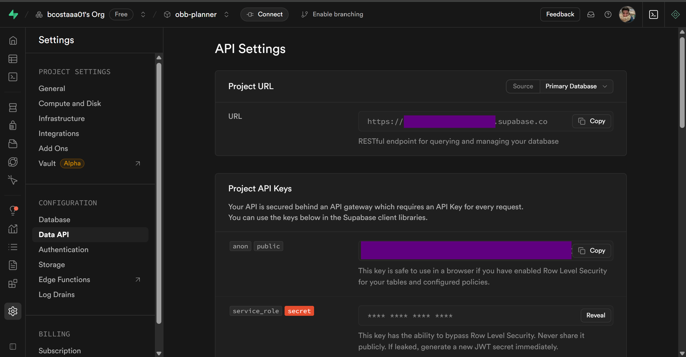

### Running the backend

In order to run the backend, please create an `.env` file, and create the following environment variables:

```.env
SUPABASE_KEY=place the Supabase key here
SUPABASE_URL=place the url of the Supabase project
```

The above can be found in the Supabase project after creation of the project on Supabase, in the API settings:

